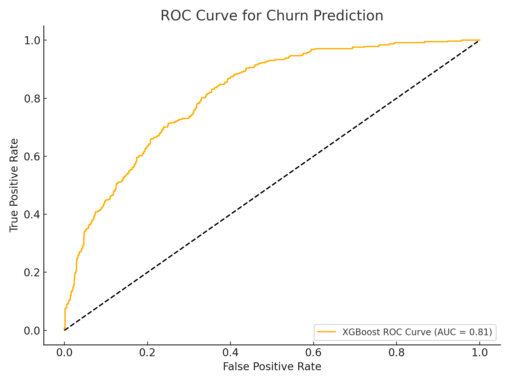

# Customer-Churn-Analysis-

This project analyzes customer churn behavior for a telecom company using machine learning. It explores churn patterns by service type, tenure, and demographics, and builds predictive models to help inform business retention strategies.



---

## Objective

To identify key drivers of customer churn and develop predictive models that can help reduce churn rates through targeted interventions.

---

## Dataset

- **Source**: Telco Customer Churn Dataset
- **Rows**: 7,043 customers
- **Features**: Demographics, service subscriptions, contract details, billing information, and churn outcome.

---

## Tools & Technologies

- Python
- Pandas & NumPy
- Scikit-learn (Logistic Regression, preprocessing)
- XGBoost
- Seaborn & Matplotlib (visualization)

---

## Project Highlights

- **Data Cleaning**: Handled missing and invalid values in `TotalCharges`.
- **Feature Engineering**:
  - Categorical encoding (Label Encoding & One-Hot Encoding)
  - Feature scaling with `StandardScaler`
  - Created custom feature: `tenure_group`
- **Modeling**:
  - Baseline: Logistic Regression
  - Optimized: XGBoost Classifier
- **Evaluation**:
  - Confusion Matrix
  - Classification Report
  - ROC Curve (AUC Score)

---

## Project Structure

| File                     | Description                                      |
|--------------------------|--------------------------------------------------|
| `customer_churn_analysis.py` | Full preprocessing, modeling & evaluation pipeline |
| `sample_cleaned_data.csv`     | Cleaned dataset sample (first 20 rows)             |
| `model_evaluation.txt`        | Evaluation reports for both models                |
| `roc_curve.png`               | ROC Curve image from XGBoost model                |

---

## Key Insights

- Churn rate is highest among:
  - Customers with **month-to-month contracts**
  - Users **lacking tech support or online security**
  - Customers with **high monthly charges** and **short tenure**
- Contract length and service coverage are key churn indicators.

---

## How to Run

1. Clone the repository:
```bash
git clone https://github.com/your-username/customer-churn-analysis.git
cd customer-churn-analysis
